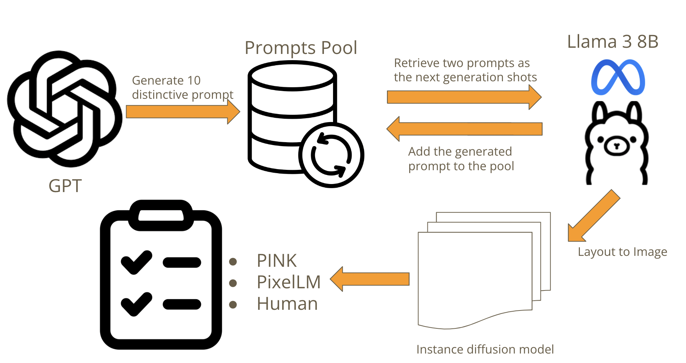
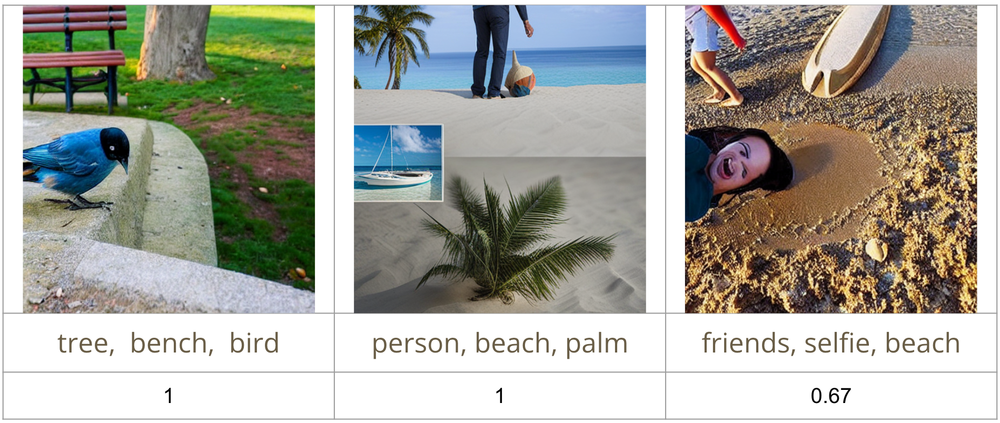

# CVPDL -- Created Vision-generation Preference Decision via LM


## 0. Project Report

- See `report.pdf`.

## 1. Scenario Prompt Generation

- We utilize `ChatGPT` to generate the 10 prompts into the prompt pools.
- We utilize `llama3` via `unsolth` package to generate the scenario.

### Run
```sh
cd llama3_for_cv
python3 unsolth_llama3_cv.py
```

if encouter RUNTIME Error for unsolth

find
```sh
YOUR_PATH/python3.9/site-packages/unsloth/models/llama.py
```

comment out line 1645

```python
#raise RuntimeError('Unsloth currently does not support multi GPU setups - but we are working on it!')
```

- It will generate 100 prompts and store into `llama3_for_cv/result.jsonl`.
```json
{"caption": "A serene beach scene at sunset with a wooden pier and calm sea.", "annos": [{"caption": "wooden pier"}, {"caption": "calm sea"}, {"caption": "setting sun"}]}
{"caption": "A person relaxing on a beach with a palm tree and a sailboat in the background.", "annos": [{"caption": "person"}, {"caption": "palm tree"}, {"caption": "sailboat"}]}
{"_COMMENT": "So on so forth"}
```

## 2. Generate layout
```sh
python layout.py ${input} ${output}
```
```
{
    "caption": "A person sitting on a beach with a sunset in the background.",
    "width": 512,
    "height": 512,
    "annos": [
        {
            "bbox": [
                0,
                200,
                143,
                187
            ],
            "mask": [],
            "category_name": "",
            "caption": "person"
        },
        {
            "bbox": [
                0,
                0,
                102,
                193
            ],
            "mask": [],
            "category_name": "",
            "caption": "beach"
        },
        {
            "bbox": [
                200,
                0,
                164,
                154
            ],
            "mask": [],
            "category_name": "",
            "caption": "sunset"
        }
    ]
}
```

## 3. Image Generation -- Instance Diffusion
### Preprocessing
See the tutorial in the following github README page to build the model:
[InstanceDiffusion](https://github.com/frank-xwang/InstanceDiffusion)
```sh
git clone https://github.com/frank-xwang/InstanceDiffusion.git
conda create --name instdiff python=3.8 -y
conda activate instdiff
pip install -r requirements.txt
```
- Download the pretrained model via their README.

### Run
```sh
python inference.py \
  --num_images 8 \
  --output OUTPUT/ \
  --input_json demos/demo_cat_dog_robin.json \
  --ckpt pretrained/instancediffusion_sd15.pth \
  --test_config configs/test_box.yaml \
  --guidance_scale 7.5 \
  --alpha 0.8 \
  --seed 0 \
  --mis 0.36 \
  --cascade_strength 0.4
```
- modify the `input_json` file path to our generated JSON file in `Section 2. Generate layout`

## 4-1. PixelLM BenchMark

### Preprocessing
```sh
git clone https://github.com/MaverickRen/PixelLM.git
mv ./inference_for_cv.sh ./PixelLM
mv ./chat_for_cv.py ./PixelLM
mv ./look_up_the_result.py/PixelLM
mkdir ./PixelLM/vis_output
mkdir ./PixelLM/mask_result
```

- Download the `PixelLM-7B` checkpoint via the instruction of their README. [PixelLM](https://github.com/MaverickRen/PixelLM)

### File Input Structure

- The file input should be structured to
```
PixelLM
|
|---prompts_path
|      |
|      |---1.json
|      |---2.json
|      |---3.json
|      |......
|
|---image_path
|     |
|     |---1.json/gc7.5-seed0-alpha0.8
|     |           |-----0_xl_s0.4_n20.png
|     |           |-----1_xl_s0.4_n20.png
|     |           |-----......
|     |
|     |---2.json/gc7.5-seed0-alpha0.8
|                 |-----0_xl_s0.4_n20.png
|                 |-----1_xl_s0.4_n20.png
|                 |-----......
|......
```


### Run
```sh
cd PixelLM
sh inference_for_cv.sh
```

### Look up the result

- Overall average
```sh
python3 look_up_the_result.py --type "all" --result_file "result.json"
```

- Specific range

```sh
python3 look_up_the_result.py --range "[start];[end]" --result_file "result.json"
```

## 4-2 Pink Bench Mark
### Pink Weights
Base: [Pink_Base](https://huggingface.co/SY-Xuan/Pink_base)
### LLaMA2 Weight Download
---
Our model is based on Llama-2-7b-chat-hf. You need to download the weights manually.

Llama-2-7b-chat-hf: [Llama-2-7b-chat-hf](https://huggingface.co/meta-llama/Llama-2-7b-chat-hf)
### Inference Pink
```sh
python Pink_inference.py \
    --json_folder /path/to/Final_cvpdl/Pink/prompt \
    --image_folder/path/to/Pink/image_folders \
    --model_name /path/to/Pink/Pink_base \
    --llama_path /path/to/Pink/meta-llamaLlama-2-7b-chat-hf \
    --output_dir /path/to/Pink/output_image \
    --output_file /path/to/output.json

```
## 4-3 Human Benchmark
The human evaluation criteria require that objects must be in a
recognizable form as they would appear in their natural state to
be considered valid. Partially incomplete but still identifiable
objects are also scored. For example, a distorted human face
would not be considered valid, while a generative model that
produces only the lower half of a human body would still
receive a score if the lower half is recognizable as such.



## 5. Calculate MSE
```sh
python eval.py ${human_score.json} ${PixelLM.json} ${PINK.json}
```
